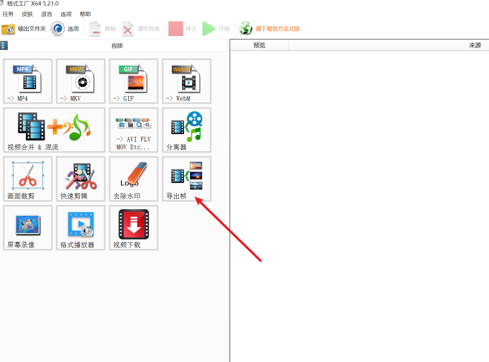
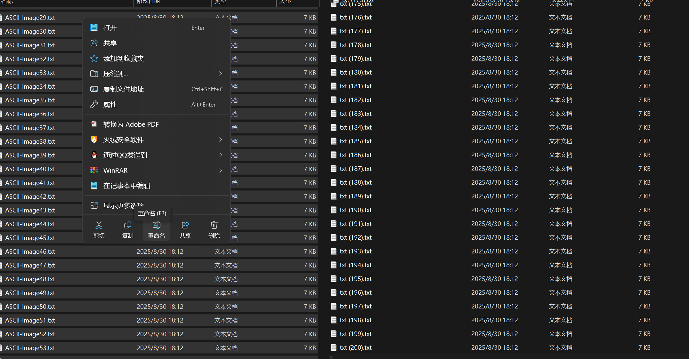

# fork form kunkun.c_code

## 修改

1.删除了音乐功能。

2.添加了清屏功能。

3.自动识别text文件下的文件数目。

4.播完暂停。

## Release

添加了release版本，直接替换text内容后即可点开 code_video.exe 运行程序。

release版本文件路径为  text\\txt

## 添加工具

添加了图片转字符工具  Ascgen2

 ## 教程

1.使用工具（如格式工厂）将视频切割成一张张图片

2.将图片一键转换为字符格式 (Ascgen2) 注意文件

3.重命名

4.自己用录屏软件录制视频。

5.建议完成后放入剪辑软件根据音频大小来给视频加速，来达到所想要的效果。
